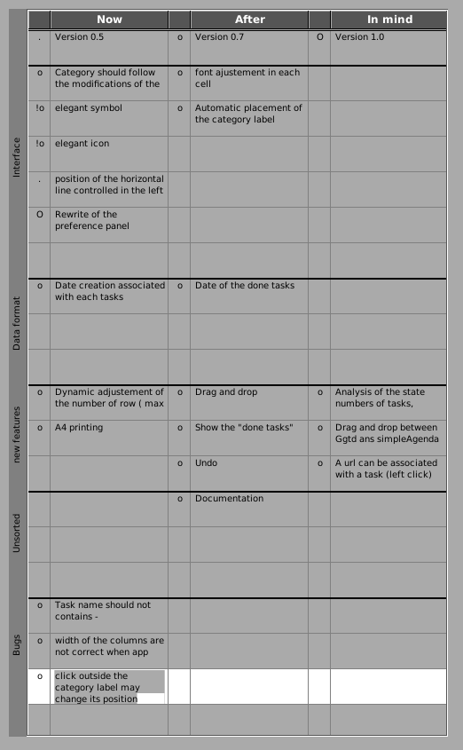

# Ggtd


## Introduction

Ggtd is yet  another "Get Things Done" app but using GNUstep. Another name should have been  : no one should have more than 60 tasks in mind (but it was a little bit to long). 



The aim of this small app is 
 * to have a complete view of all the pending tasks, 
 * to clearly identify the length, priority, state of the tasks,
 * to be efficient when creating a new task
 * and even more...

## How it works
 
This app has first being created using a sheet of paper and a eraser : I have drawn 3 columns labelled "today", "after", "to keep in mind" and I start to note my tasks according to these descriptions. I decide that only one face of the sheet should have to be used and due to the avalaible space and of the size of my writing only 20 lines could then be used. 

Using symbols derived from bullet journal, I label each task with the following symbols for the length of the tasks:
* . : a short task
* o : an moderate task
* O : a long task

I added a symbol before the symbol .|o|O to described the state of the task :
* ! : urgent
* \> : programmed
* < : started


I also  drawn an horizontal line between group of tasks of the same category ("perso", "sport", etc.


I obtained finally a sheet with 60 tasks max classified in length, state and urgency and category. It was very efficient. This method is thus a mix between bullet journal and kanban table.

I decided to create the app when the paper was so used that the eraser was no more able to erase anything.


## Installation

If gnustep is correctly installed on your computer : 

```make```

should build the app and 

```sudo -E make install```

should install it

## Using the app
* double-clic in a big cell let you type a new task. When a new task is create, the symbol o is attached to it
* you can click on the symbol to change the length of the task
* you can control-click on the symbol to change the state of the task
* you can rename (double-click) and move the category one the left
* you can remove of add large horizontal lines between the category : the app does not control the position of these lines according to the position of the categories.  
* preferences panel let you change the width of the columns and the size font used in the cells. 
* moving task from one place to another is perfomed usinf cut and paste.
* the default directory where the task file is create if the user Desktop directory
* the default filename is "tasks.gtd"


## TODO and BUGS
The first public version is labelled 0.3. 

see TODO.gtd file that also corresponds to the screenshot at the beginning of this page. This file also indicated the bugs of the current version.

BUG : with the first start, the width column will be incorrect. Open the preference panel and adjust it.

## Licence
This software is provided as is with a GPL v3 licence. If you like it, please send me a postcard at [nicepi31.wezegi99@murena.io](mailto:nicepi31.wezegi99@murena.io). Comments and remarks are also welcome.